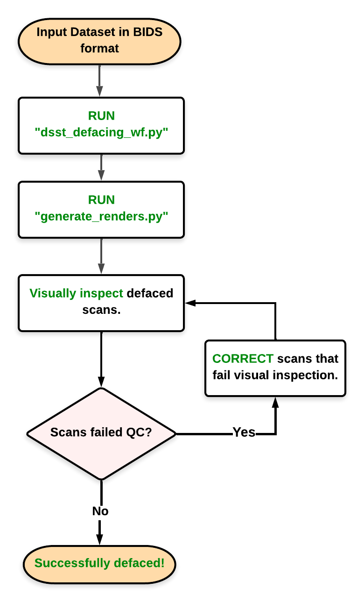

# DSST Defacing Pipeline

The DSST Defacing Pipeline has been developed to make the process of defacing anatomical scans as well as
visually quality controlling (QC) and fixing scans that fail QC more efficient and straightforward. The
pipeline requires the input dataset to be in BIDS format. A conceptual description of the pipeline can be
found [below](#conceptual-design).

This pipeline is designed and tested to work on the NIH HPC systems. While it's possible to get the pipeline running on
other platforms, please note that it can be error-prone and is not recommended.

## Setup Instructions

### 1. Clone this repository

```bash
git clone https://github.com/nimh-dsst/dsst-defacing-pipeline.git
```

### 2. Install required packages

Apart from AFNI and FSL packages, available as HPC modules, users will need the following packages in their working
environment

- VisualQC
- FSLeyes
- Python 3.7+

There are many ways to create a virtual environment with the required packages, however, we currently only provide
instructions to create a conda environment. If you don't already have conda installed, please find
[Miniconda install instructions here](https://docs.conda.io/en/latest/miniconda.html).

### 3. Create a conda environment

Run the following command to create a conda
environment called `dsstdeface` using the `environment.yml` file from this repo.

```bash
conda env create -f environment.yml
```

Once conda finishes creating the virtual environment, activate `dsstdeface`.

```bash
conda activate dsstdeface
```

## Usage

To deface anatomical scans in the dataset, run the `src/dsst_defacing_wf.py` script. From within the `dsst-defacing-pipeline` cloned directory, run the following command to see the help message.

```text
% python src/run.py -h

usage: dsst_defacing_wf.py [-h] [-n N_CPUS]
                           [-p PARTICIPANT_LABEL [PARTICIPANT_LABEL ...]]
                           [-s SESSION_ID [SESSION_ID ...]]
                           [--no-clean]
                           bids_dir output_dir

Deface anatomical scans for a given BIDS dataset or a subject
directory in BIDS format.

positional arguments:
  bids_dir              The directory with the input dataset
                        formatted according to the BIDS standard.     
  output_dir            The directory where the output files should   
                        be stored.

options:
  -h, --help            show this help message and exit
  -n N_CPUS, --n-cpus N_CPUS
                        Number of parallel processes to run when      
                        there is more than one folder. Defaults to    
                        1, meaning "serial processing".
  -p PARTICIPANT_LABEL [PARTICIPANT_LABEL ...], --participant-label PARTICIPANT_LABEL [PARTICIPANT_LABEL ...]
                        The label(s) of the participant(s) that       
                        should be defaced. The label corresponds to   
                        sub-<participant_label> from the BIDS spec    
                        (so it does not include "sub-"). If this      
                        parameter is not provided all subjects        
                        should be analyzed. Multiple participants     
                        can be specified with a space separated       
                        list.
  -s SESSION_ID [SESSION_ID ...], --session-id SESSION_ID [SESSION_ID ...]
                        The ID(s) of the session(s) that should be    
                        defaced. The label corresponds to
                        ses-<session_id> from the BIDS spec (so it    
                        does not include "ses-"). If this parameter   
                        is not provided all subjects should be        
                        analyzed. Multiple sessions can be specified  
                        with a space separated list.
  --no-clean            If this argument is provided, then AFNI       
                        intermediate files are preserved.
```

The script can be run serially on a BIDS dataset or in parallel at subject/session level. Both these methods of running
the script have been described below with example commands.

### Option 1: Serial defacing

If you have a small dataset with less than 10 subjects, then it might be easiest to run the defacing algorithm serially.

```bash
python src/dsst_defacing_wf.py ${INPUT_DIR} ${OUTPUT_DIR}
```

### Option 2: Parallel defacing

If you have dataset with over 10 subjects and since each defacing job is independent, it might be more practical to run the pipeline in parallel for every
subject/session in the dataset using the `-n/--n-cpus` option. The following example command will run the pipeline occupying 10 processors at a time.

```bash
python src/dsst_defacing_wf.py ${INPUT_DIR} ${OUTPUT_DIR} -n 10
```

Additionally, the pipeline can be run on a single subject or session using the `-p/--participant-label` and `-s/--session-id`, respectively. 

## Visual Inspection

To visually inspect quality of defacing with [VisualQC](https://raamana.github.io/visualqc/readme.html), we'll need to:

1. Open TurboVNC through an spersist session. More info on [the NIH HPC docs](https://hpc.nih.gov/docs/nimh.html).
2. Run the `vqcdeface` command from a command-line terminal within a TurboVNC instance

    ```bash
    sh ${OUTPUT_DIR}/QC_prep/defacing_qc_cmd
    ```

## Conceptual design

1. Generate a ["primary" scans](#terminology) to [other scans](#terminology) mapping file.
2. Deface primary scans
   with [@afni_refacer_run](https://afni.nimh.nih.gov/pub/dist/doc/htmldoc/tutorials/refacer/refacer_run.html) program
   developed by the AFNI Team.
3. To deface remaining scans in the session, register them to the primary scan (using FSL `flirt` command) and then use
   the primary scan's defacemask to generate a defaced image (using `fslmaths` command).
4. Visually inspect defaced scans with [VisualQC](https://raamana.github.io/visualqc) deface tool or any other preferred
   tool.
5. Correct/fix defaced scans that failed visual inspection. See [here](FILLINTHEBLANK) for more info on types of failures.



## Terminology

While describing this process, we frequently use the following terms:

- **Primary Scan:** The best quality T1w scan within a session. For programmatic selection, we assume that the most
  recently acquired T1w scan is of the best quality.
- **Other/Secondary Scans:** All scans *except* the primary scan are grouped together and referred to as "other" or
  "secondary" scans for a given session.
- **Mapping File:** A JSON file that assigns/maps a primary scan (or `primary_t1`) to all other scans within a session.
  Please find an example file [here](https://github.com/nimh-dsst/dsst-defacing-pipeline/blob/47288e429d0614a1d0be44f7176f85570823fbaa/examples/primary_to_others_mapping.json).
- **[VisualQC](https://raamana.github.io/visualqc):** A suite of QC tools developed by Pradeep Raamana, PhD (Assistant
  Professor at University of Pittsburgh).

## References

1. Theyers AE, Zamyadi M, O'Reilly M, Bartha R, Symons S, MacQueen GM, Hassel S, Lerch JP, Anagnostou E, Lam RW, Frey
   BN, Milev R, Müller DJ, Kennedy SH, Scott CJM, Strother SC, and Arnott SR (2021)
   [Multisite Comparison of MRI Defacing Software Across Multiple Cohorts](10.3389/fpsyt.2021.617997). Front. Psychiatry
   12:617997. doi:10.3389/fpsyt.2021.617997
2. `@afni_refacer_run` is the defacing tool used under the
   hood. [AFNI Refacer program](https://afni.nimh.nih.gov/pub/dist/doc/htmldoc/tutorials/refacer/refacer_run.html).
3. FSL's [FLIRT](https://fsl.fmrib.ox.ac.uk/fsl/fslwiki/FLIRT)
   and [`fslmaths`](https://fsl.fmrib.ox.ac.uk/fsl/fslwiki/Fslutils?highlight=%28fslmaths%29) programs have been used
   for registration and masking steps in the workflow.
4. [VisualQC](https://raamana.github.io/visualqc/) utility.

## Acknowledgements

We'd like to thank [Pradeep Raamana, PhD.](https://www.aimi.pitt.edu/people/ant), Assistant Professor at the Department of
Radiology at University of Pittsburgh, and [Paul Taylor](https://afni.nimh.nih.gov/Staff), Acting Director of Scientific
and Statistical Computing Core (SSCC) at NIMH for their timely help in resolving and adapting VisualQC and AFNI Refacer,
respectively, for the specific needs of this project.
